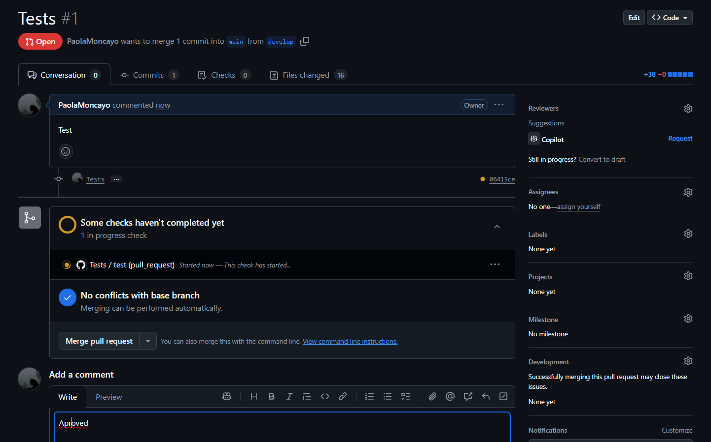
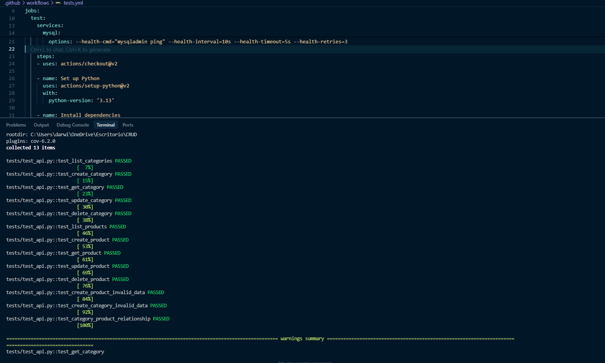
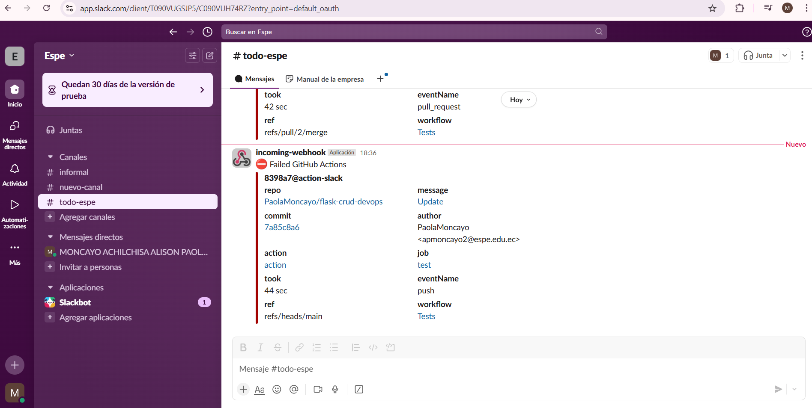

# CRUD de Productos y Categorías

Este es un sistema CRUD simple para gestionar productos y categorías, implementado **sin el uso de frameworks**.

---

## Estructura del Proyecto

```
.
├── database.py      # Manejo de la base de datos SQLite
├── server.py        # Servidor HTTP básico
├── templates/       # Plantillas HTML
│   └── index.html   # Interfaz de usuario
├── tests/           # Pruebas automáticas
├── docs/
│   └── img/         # Imágenes de evidencia
├── requirements.txt # Dependencias del proyecto
├── .env.example     # Ejemplo de variables de entorno
└── README.md
```

---

## Requisitos

- Python 3.6 o superior
- SQLite3

---

## Instalación

1. Clonar el repositorio:
   ```bash
   git clone <url-del-repositorio>
   cd <nombre-del-directorio>
   ```

2. Crear un entorno virtual (opcional pero recomendado):
   ```bash
   python -m venv venv
   # En Windows:
   venv\Scripts\activate
   # En Linux/Mac:
   source venv/bin/activate
   ```

3. Instalar dependencias:
   ```bash
   pip install -r requirements.txt
   ```

4. Configurar variables de entorno:
   Copia el archivo `.env.example` a `.env` y edítalo según tu configuración.

---

## Uso

1. Iniciar el servidor:
   ```bash
   python server.py
   ```

2. Abrir en el navegador:
   ```
   http://localhost:8000
   ```

---

## Funcionalidades

- **Gestión de Categorías:**
  - Crear categorías
  - Ver lista de categorías
  - Eliminar categorías

- **Gestión de Productos:**
  - Crear productos
  - Ver lista de productos
  - Eliminar productos
  - Asociar productos a categorías

---

## API Endpoints

### Categorías
- `GET /api/categories` - Obtener todas las categorías
- `POST /api/categories` - Crear una nueva categoría
- `DELETE /api/categories/{id}` - Eliminar una categoría

### Productos
- `GET /api/products` - Obtener todos los productos
- `POST /api/products` - Crear un nuevo producto
- `DELETE /api/products/{id}` - Eliminar un producto

---

## Evidencias Visuales

### Interfaz en ejecución


### Commits en ramas de pruebas

- **Rama develop:**
  
- **Rama test:**
  

### Ejecución de tests



### Notificación de Slack funcionando



---

## Flujo de trabajo con Git y GitHub

1. Configura tu usuario de Git:
   ```bash
   git config --global user.name "Tu Nombre"
   git config --global user.email "tuemail@ejemplo.com"
   ```

2. Crea ramas principales:
   ```bash
   git checkout main
   git pull origin main
   git checkout -b develop
   git push origin develop
   git checkout main
   git checkout -b test
   git push origin test
   ```

3. Crea una rama para tu feature (desde develop):
   ```bash
   git checkout develop
   git pull origin develop
   git checkout -b feature/nueva-funcionalidad
   ```

4. Haz cambios y commit:
   ```bash
   git add .
   git commit -m "feat: Nueva funcionalidad [País]"
   ```

5. Sincroniza cambios antes de subir:
   ```bash
   git pull origin develop
   ```

6. Sube tu rama al repositorio:
   ```bash
   git push origin feature/nueva-funcionalidad
   ```

7. Crea un Pull Request (PR) hacia `develop` y etiqueta a tus compañeros para revisión.

---

## Comunicación y Colaboración

- **WhatsApp/Telegram** para comunicación rápida.
- **Google Docs** para documentación compartida.

---

## Reflexión Intercultural

### Resolución de Conflictos

- Usamos herramientas visuales de merge (VSCode, GitHub).
- Antes de resolver un conflicto, nos comunicamos por WhatsApp para entender el contexto.
- Documentamos las decisiones importantes en Google Docs.

### Herramientas de Comunicación

- WhatsApp/Telegram para avisos urgentes o coordinación rápida.
- Google Docs para actas de reuniones y documentación de decisiones.

### Consideraciones de Husos Horarios

- Documentamos los horarios de trabajo de cada miembro en Google Docs.
- Usamos herramientas asíncronas (GitHub, Google Docs) para que todos puedan avanzar a su ritmo.
- Establecemos ventanas de tiempo para reuniones donde todos puedan coincidir.

### Análisis de desafíos interculturales y técnicos

> Trabajar en un equipo distribuido internacionalmente nos obligó a ser muy claros en la comunicación y a documentar todo. Los conflictos de merge se resolvieron con diálogo y herramientas visuales, priorizando siempre la comprensión mutua. La diferencia de husos horarios nos llevó a planificar tareas asíncronas y a respetar los tiempos de respuesta de cada miembro. El uso de GitHub Actions y Slack permitió que todos estuviéramos informados sobre el estado del proyecto, sin importar la hora o el lugar. La colaboración intercultural enriqueció el proyecto, aportando diferentes perspectivas y soluciones creativas a los problemas técnicos y organizativos.

---

## Contribuidores

- Paola Moncayo [Colombia]
- [Agrega aquí los nombres y países de los demás miembros]

---

## Licencia

MIT

---

## Estructura de carpetas para imágenes

```
flask-crud-devops/
│
├── docs/
│   └── img/
│       ├── app-running.png
│       ├── slack-notification.png
│       ├── commits-develop.png
│       ├── commits-test.png
│       └── tests-running.png
```

---

## .env.example

```env
# Configuración de la base de datos
DB_HOST=localhost
DB_PORT=3306
DB_USER=usuario
DB_PASSWORD=contraseña
DB_NAME=nombre_base_datos

# Otros (si usas servicios externos)
# API_KEY=tu_api_key
``` 
